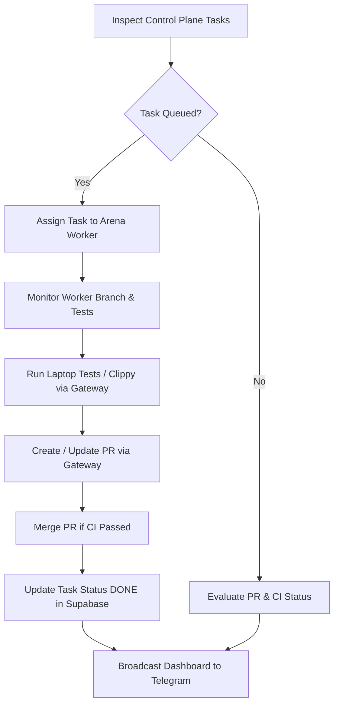

# Arena Manager Runtime Guide (Antigravity-Independent)

Panduan operasional resmi untuk **Arena Manager** beroperasi secara otonom tanpa memerlukan Antigravity saat runtime.

---

## 1. Posisi Arsitektur & Topologi Branch

### Branch Topology:
- **`main`**: Integration branch tunggal, production & single source of truth.
- **`arena-manager`**: Permanent Manager source branch & orchestrator identity (ACTIVE).
- **`arena-agent`**: Legacy Manager branch (DEPRECATED / PRESERVED for compatibility).
- **`arena/<workspace-id>-n8n-rust-v-4`**: Temporary workspace runtime branch yang di-generate otomatis oleh platform Arena.

Saat sistem selesai diprovisi oleh Antigravity:
- **Antigravity**: OFFLINE / Debugging only.
- **Capability Gateway Daemon**: Berjalan sebagai service background lokal di host/laptop (`http://127.0.0.1:8787`).
- **Arena Manager**: Agen AI orchestrator utama yang berinteraksi melalui HTTP API atau CLI gateway.
- **Workers**: Workforce agen eksekusi coding yang mengklaim tugas dari Control Plane dan mengeksekusi branch arena.

---

## 2. Kredensial & Batasan Keamanan

Arena Manager **TIDAK PERNAH** menerima kredensial upstream:
- `GITHUB_TOKEN`: Tersimpan di Vault.
- `SUPABASE_SERVICE_ROLE_KEY`: Tersimpan di Vault.
- `TELEGRAM_BOT_TOKEN`: Tersimpan di Vault.
- `LAPTOP_WEBHOOK_SECRET`: Tersimpan di Vault.

Arena Manager hanya memegang **Gateway Manager Token** (`agm_...`), yang:
1. Hanya berfungsi pada endpoint Capability Gateway (`POST /api/v1/invoke`).
2. Tidak dapat digunakan secara langsung untuk menghubungi GitHub API atau Supabase PostgREST.

---

## 3. Siklus Hidup Orkestrasi (Orchestration Loop)

Arena Manager menjalankan siklus orkestrasi berulang:



### Langkah-langkah Pemanggilan:

1. **Memeriksa Status Proyek**:
   ```bash
   python -m tools.gateway.cli invoke --caller arena-manager --capability supabase.get_project_state
   ```

2. **Memeriksa Antrean Task**:
   ```bash
   python -m tools.gateway.cli invoke --caller arena-manager --capability supabase.inspect_tasks --params '{"status": "QUEUED"}'
   ```

3. **Membuat Branch Kerja Baru untuk Worker**:
   ```bash
   python -m tools.gateway.cli invoke --caller arena-manager --capability github.create_branch --params '{"branch": "arena/worker-01/m6-deserializer", "base": "main"}'
   ```

4. **Menjalankan Validasi Test Lokal**:
   ```bash
   python -m tools.gateway.cli invoke --caller arena-manager --capability laptop.run_test --params '{"crate": "n8n-workflow"}'
   ```

5. **Membuat Pull Request**:
   ```bash
   python -m tools.gateway.cli invoke --caller arena-manager --capability github.create_pr --params '{"title": "feat(model): implement workflow JSON deserializer", "head": "arena/worker-01/m6-deserializer", "base": "main", "body": "Automated PR created by Arena Manager"}'
   ```

6. **Memeriksa Status CI**:
   ```bash
   python -m tools.gateway.cli invoke --caller arena-manager --capability github.get_ci
   ```

7. **Mengirim Update ke Telegram**:
   ```bash
   python -m tools.gateway.cli invoke --caller arena-manager --capability telegram.send_message --params '{"text": "✅ PR #33 passed CI and merged into main.", "parse_mode": "Markdown"}'
   ```

---

## 4. Prosedur Startup & Pemulihan (Startup & Recovery)

### Menjalankan Gateway Daemon:
```powershell
# Jalankan daemon di background
python -m tools.gateway.server --host 127.0.0.1 --port 8787
```

### Health Check Gateway:
```powershell
curl http://127.0.0.1:8787/health
# Menghasilkan: {"status": "HEALTHY", "version": "1.7.0"}
```

Jika terjadi gangguan jaringan atau kegagalan child process:
1. Gateway menangkap exception secara aman.
2. Pesan error disanitasi dari segala kredensial.
3. Audit log mencatat error dengan kode status `ERROR`.
4. Arena Manager menerima respons `{"ok": false, "error": "<sanitized message>"}` dan dapat melakukan retry atau eskalasi via Telegram.
